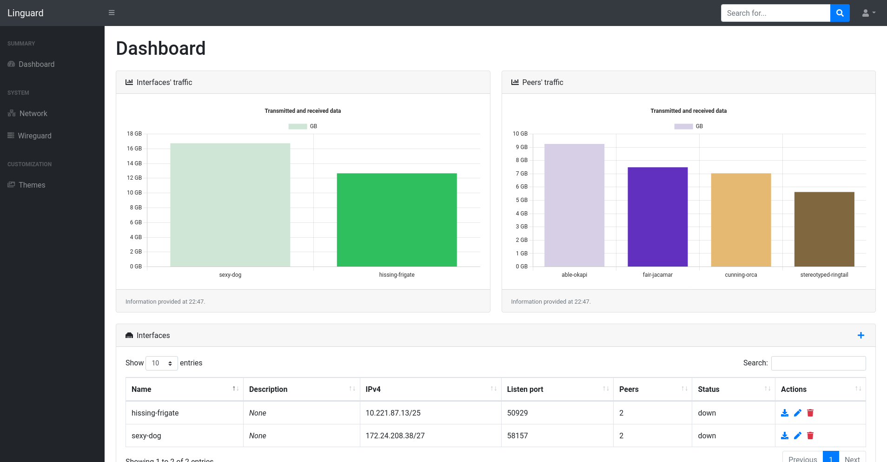
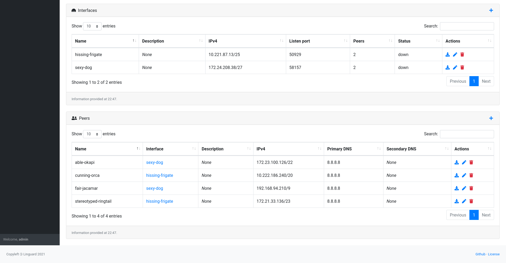
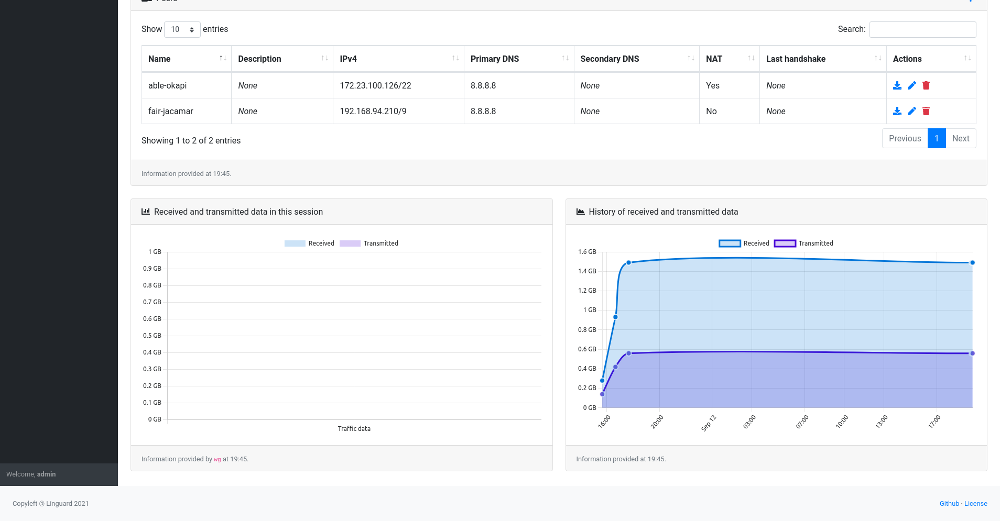
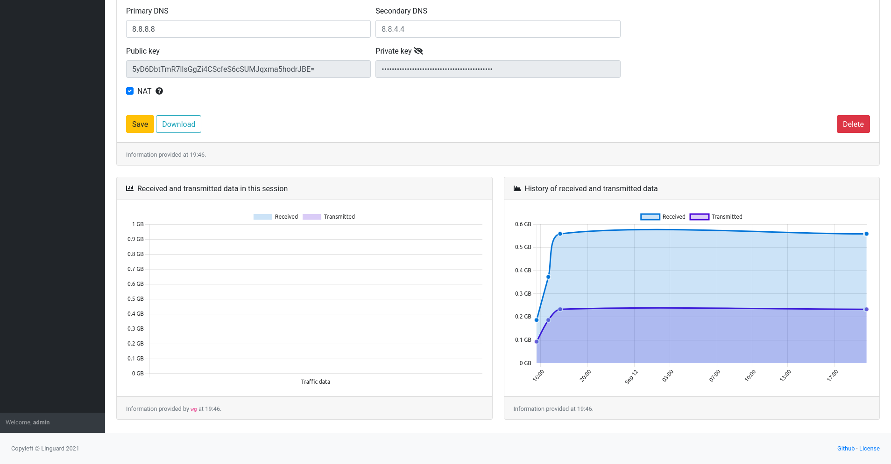
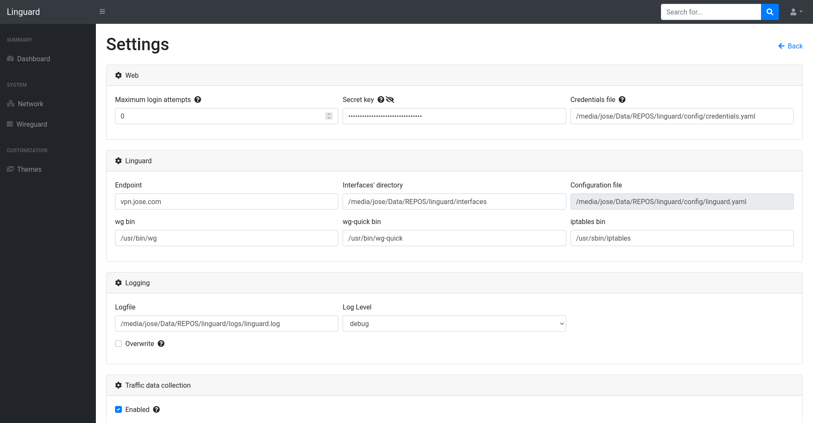
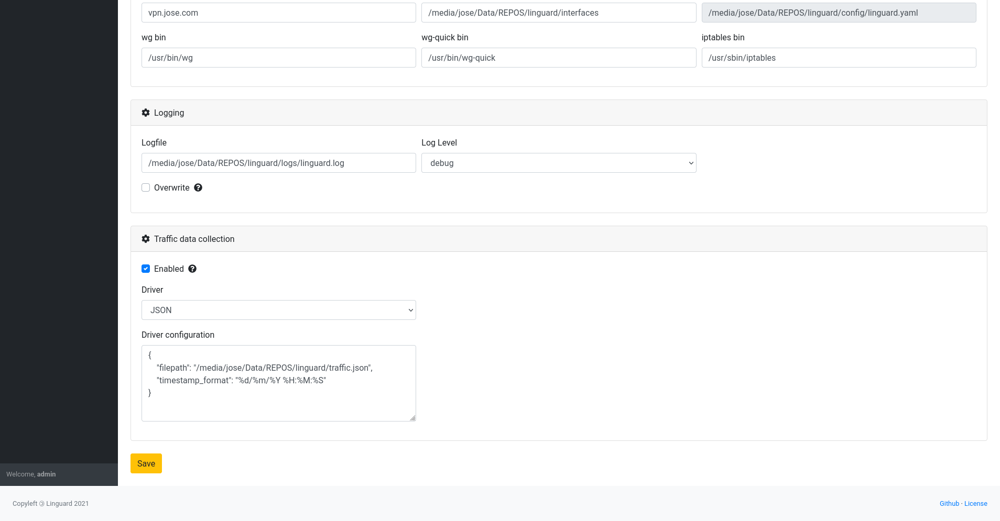

# Linguard

[](LICENSE.md)  [](https://github.com/joseantmazonsb/linguard/actions/workflows/main.yaml) [](https://codecov.io/gh/joseantmazonsb/linguard)

[](https://github.com/joseantmazonsb/linguard/releases) [](https://github.com/joseantmazonsb/linguard/releases) [](https://hub.docker.com/repository/docker/joseantmazonsb/linguard)


Linguard aims to provide an easy way to manage your WireGuard server, and it's written in Python3 and powered by Flask.

Check out [the wiki](https://github.com/joseantmazonsb/linguard/wiki) for additional info!

## Table of contents
- [Installation](#installation)
    - [Release](#release)
    - [Docker](#docker)
- [Screenshots](#screenshots)
- [Contributing](#contributing)

## Installation

### Release

1. Download [any release](https://github.com/joseantmazonsb/linguard/releases).
    
2. Extract it and run the installation script:
    ```bash
    chmod +x install.sh
    sudo ./install.sh
    ```
3. Run Linguard: 
    ```bash
    sudo systemctl start linguard.service
    ```

### Docker

## Screenshots











## Contributing

You may contribute by opening new issues, commenting on existent ones and creating pull requests with new features and bugfixes. Any help is welcome :)
