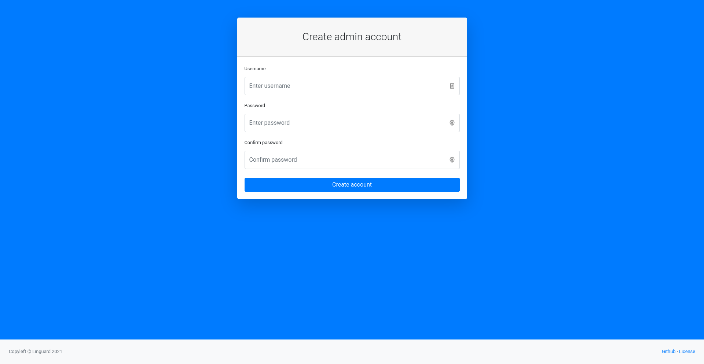
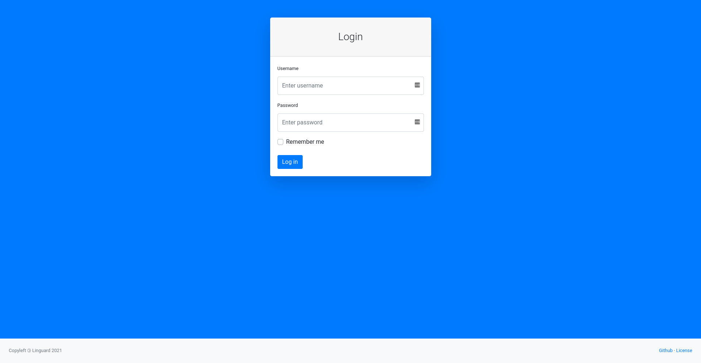

# Linguard

[](https://codecov.io/gh/joseantmazonsb/linguard)

Linguard aims to provide an easy way to manage your WireGuard server, and it's written in Python3 and powered by Flask.

## Table of contents
- [Screenshots](#screenshots)
- [Installation](#installation)
    - [Git](#git)
    - [Debian package](#debian-package)
    - [Docker](#docker)
- [Contributing](#contributing)

## Screenshots





## Installation

### Git

1. Download the installation script and run it. You must supply the installation directory (for instance, `/var/www/linguard`) and (optionally) the tag to check out.
    ```bash
    wget -q https://raw.githubusercontent.com/joseantmazonsb/linguard/main/scripts/install.sh .
    chmod +x install.sh
    sudo ./install.sh <install_folder> [git_branch]
    ```
2. Edit the configuration files located in `/var/www/linguard/config` to fit your needs.
3. Start linguard:
    ```bash
    sudo -u linguard /var/www/linguard/scripts/run.sh
    ```
    or, if you renamed the uwsgi configuration file: 
    ```bash
    sudo -u linguard uwsgi --yaml /path/to/uwsgi/config/file
    ```

### Debian package

### Docker

## Contributing

You may contribute by opening new issues, commenting on existent ones and creating pull requests with new features and bugfixes. Any help is welcome :)
