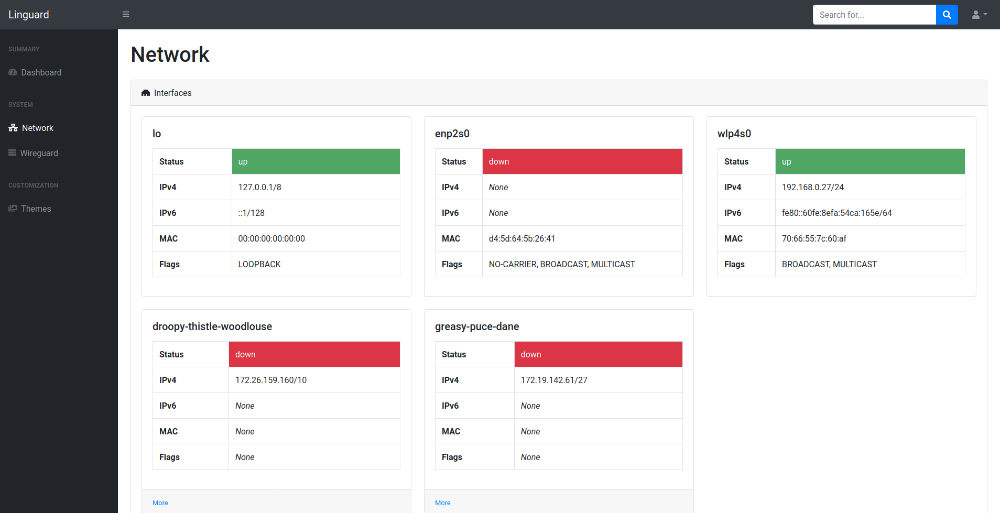
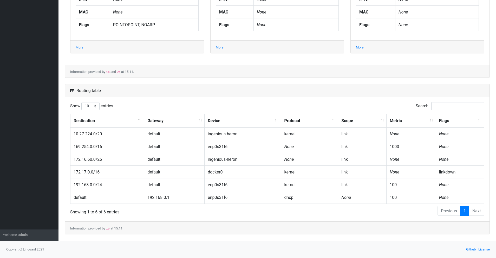
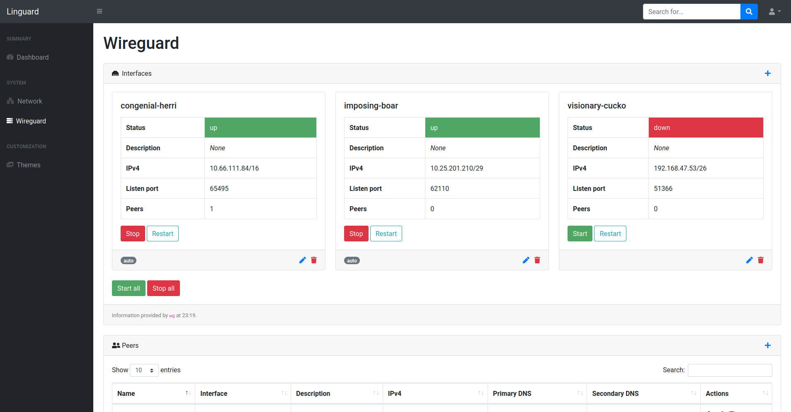
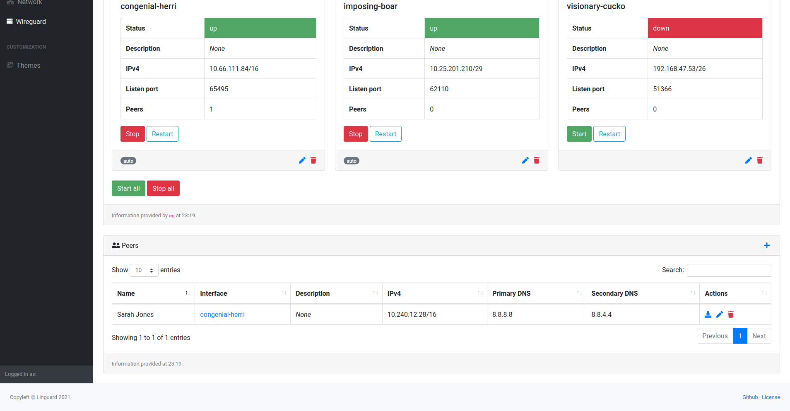
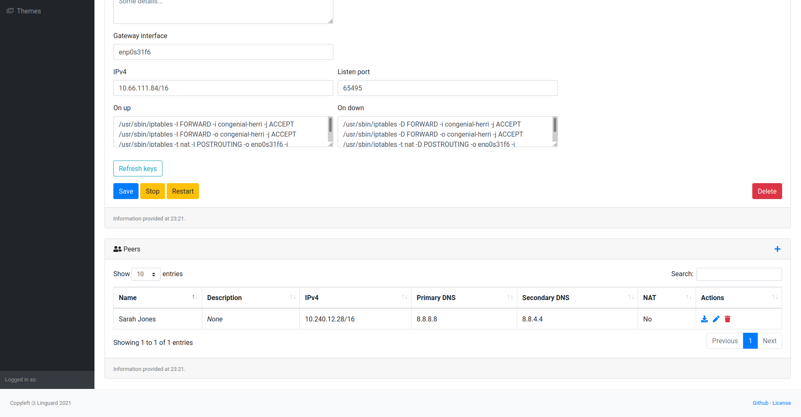
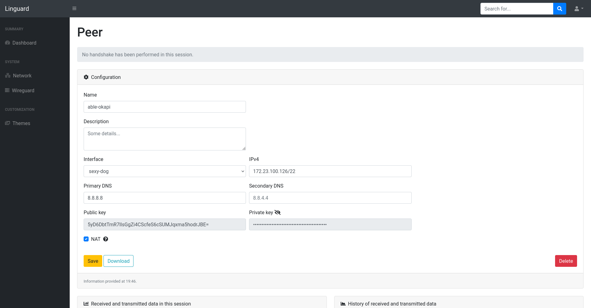
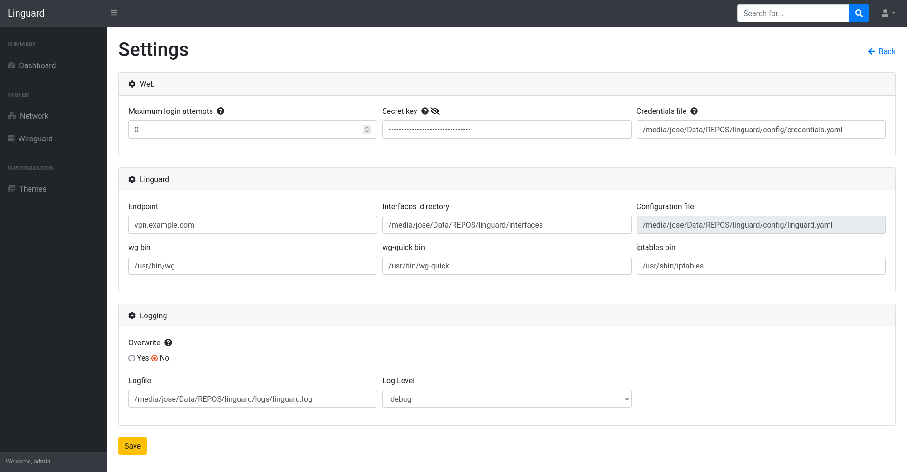

# Linguard

Linguard aims to provide an easy way to manage your WireGuard server, and it's written in Python3 and powered by Flask.

## Table of contents
- [Screenshots](#screenshots)
- [Installation](#installation)
    - [Git](#git)
    - [Debian package](#debian-package)
    - [Docker](#docker)
- [Docs](#docs)
    - [Arguments](#arguments)
    - [Configuration](#configuration)
    - [Classes](#classes)
- [Notes](#notes)
    - [Changelog](#changelog)
    - [Known issues](#known-issues)
- [Contributing](#contributing)

## Screenshots










## Installation

### Git

1. Install dependencies:
    ```bash
    sudo apt update
    sudo apt install wireguard iptables uwsgi uwsgi-plugin-python3 libpcre3 libpcre3-dev
    ```
2. Download any [release](https://github.com/joseantmazonsb/linguard/releases) (or clone the repository) and put the files somewhere you will remember later, such as `/var/www/linguard`.
3. Install the requirements:
   ```bash
    pip3 install -r requirements.txt
    ```
   *If you install the requirements using a virtual environment, you'll need to specify the path to the `venv` folder in the uwsgi configuration file through the field `venv`.*
4. Edit the configuration files to fit your needs.
5. Add a `linguard` user and group to your computer:
    ```bash
    groupadd linguard
    useradd -g linguard linguard
    ```
6. Add the following lines to the file `etc/sudoers` so that linguard may execute WireGuard commands.
    ```bash
    linguard ALL=(ALL) NOPASSWD: /usr/bin/wg
    linguard ALL=(ALL) NOPASSWD: /usr/bin/wg-quick
    ```
7. Start linguard:
    ```bash
    sudo -u linguard uwsgi --yaml /var/www/linguard/config/uwsgi.sample.yaml
    ```

### Debian package

### Docker

## Docs

### Arguments

The following table describes every argument accepted by Linguard:

| Argument | Type | Explanation | Notes
|---|---|---|---|
| *config* | Positional | Path to the Linguard's configuration file | Must be a YAML file
| *-h* \| *--help* | Optional | Display Linguard's CLI help and exit |
| *--debug* | Optional | Start the Flask backend in debug mode | Default value is `False`

### Configuration

Two sample configuration files are provided, `uwsgi.sample.yaml` and `linguard.sample.yaml`, although the most interesting one is the second, since the first only contains options for a third party software, 
[UWSGI](https://uwsgi-docs.readthedocs.io/en/latest/).

Nonetheless, it is worth noting that the path to the Linguard's configuration file needs to be provided through uwsgi's configuration, using the field `pyargv`.

For now on, we will only discuss Linguard's configuration values. Although the file `linguard.sample.yaml`
contains every possible option, the following tables explain each one of them and detail
all possible values.

#### Logging configuration

These options must be specified inside a `logger` node.

| Option | Explanation | Values | Default |
|---|---|---|---|
| _level_ | Set the minimum level of messages to be logged | `debug`, `info`, `warning`, `error`, `fatal` | `info`
| _logfile_ | Path to the file used to write log messages | `null`, `path/to/logfile` | `null`
| _overwrite_ | Whether to overwrite the log file when the application starts or not | `true`, `false` | `false`

#### Web configuration

These options must be specified inside a `web` node.

| Option | Explanation | Values | Default |
|---|---|---|---|
| _bindport_ | Port to be used by Flask to deploy the application | `1-65535` | `8080`
| _login_attempts_ | Maximum number of login attempts within 5 minutes | (almost) Any integer | `0` (unlimited attempts)

#### Linguard configuration

These options must be specified inside a `linguard` node.

##### Global options

| Option | Explanation | Values | Notes |
|---|---|---|---|
| _endpoint_ | Endpoint for all peers | Should be something like `vpn.example.com`, though it may also be an IP address | Default value is your computer's public IP (if it can be obtained)
| _wg_bin_ | Path to the WireGuard binary file (`wg`) | `path/to/file` | If not specified, it will be retrieved using the `whereis` command
| _wg_quick_bin_ | Path to the WireGuard quick binary file (`wg-quick`) | `path/to/file` | If not specified, it will be retrieved using the `whereis` command
| _interfaces_ | Dictionary containing all interfaces of the server | A number of `interface` nodes whose keys are their own UUIDs |
| _interfaces_folder_ | Path to the directory where the interfaces' configuration files will be placed. | `path/to/folder` | It should be somewhere you will remember, like `/var/www/linguard/interfaces`
| _iptables_bin_ | Path to the iptables binary file (`iptables`) | `path/to/file` | If not specified, it will be retrieved using the `whereis` command

##### Interface configuration

These options must be specified inside an `interface` node.

| Option | Explanation | Values | Notes |
|---|---|---|---|
| _auto_ | Whether the interface will be automatically brought up when the server starts or not | `true`, `false` | Default value is `true`
| _description_ | A description of the interface | A character string |
| _gw_iface_ | Gateway used by the interface | Physical interface used to connect the WireGuard interface to your network | Default value will be your computer's default gateway
| _ipv4_address_ | IPv4 address assigned to the interface | A valid IPv4 address |
| _listen_port_ | UDP port used by WireGuard to communicate with peers | `1-65535` |
| _name_ | The interface's name | A character string | It may only contain alphanumeric characters, underscores and hyphens. It must also begin with a letter and cannot be more than 15 characters long
| _on_up_ | Linux commands to be executed when the interface is going to be brought up | Any linux command in path | By default, it will add FORWARD and POSTROUTING rules related to the interface
| _on_down_ | Linux commands to be executed when the interface is going to be brought down | Any linux command in path | By default, it will remove FORWARD and POSTROUTING rules related to the interface
| _peers_ | Dictionary containing all peers of the interface | A number of `peer` nodes whose keys are their own UUIDs |
| _private_key_ | Private key used to authenticate the interface | A valid private key generated via `wg` | 
| _public_key_ | Public key used to authenticate the interface | A valid private key generated via `wg` |
| _uuid_ | Unique identifier | A valid Version 4 UUID |

##### Peer configuration

These options must be specified inside a `peer` node.

| Option | Explanation | Values | Notes |
|---|---|---|---|
| _dns1_ | Main DNS used by the peer | A valid IPv4 address |
| _dns2_ | Secondary DNS used by the peer | A valid IPv4 address |
| _ipv4_address_ | IPv4 address assigned to the peer | A valid IPv4 address |
| _name_ | The peer's name. | A character string
| _nat_ | Whether the peer is behind a NAT or not | `true`, `false` | Default value is `false`. If `true`, this option will enable the `PersistentKeepalive` WireGuard flag
| _private_key_ | Private key used to authenticate the peer | A valid private key generated via `wg` | 
| _public_key_ | Public key used to authenticate the peer | A valid private key generated via `wg` |
| _uuid_ | Unique identifier. | A valid Version 4 UUID |

### Classes

## Notes

### Changelog

### Known issues

## Contributing

You may contribute opening issues and creating pull requests with new features and bugfixes :)