How does it look?
=================

Here are a bunch of screenshots:

..  figure:: images/dashboard-1.png
    :alt: Dashboard (1)

    Dashboard (1)

..  figure:: images/dashboard-2.png
    :alt: Dashboard (2)

    Dashboard (2)

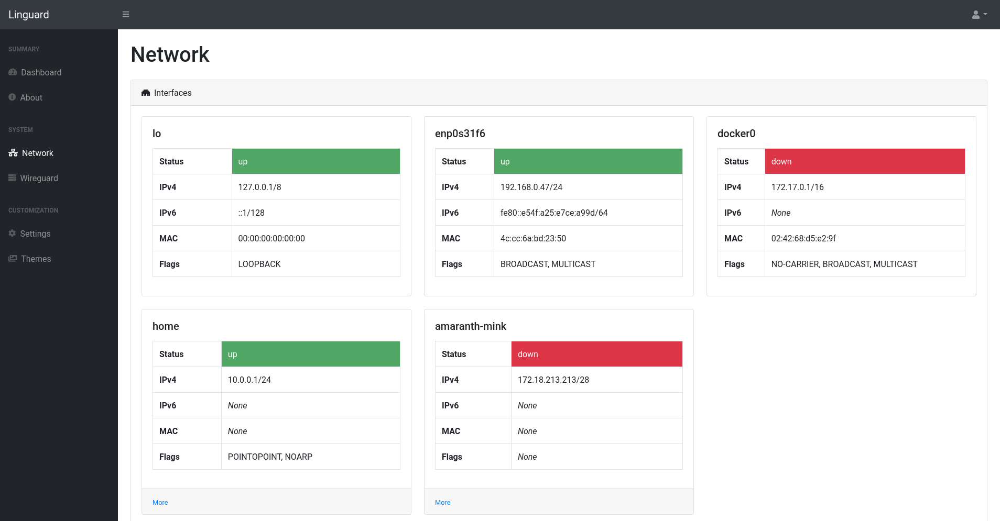

    Network interfaces

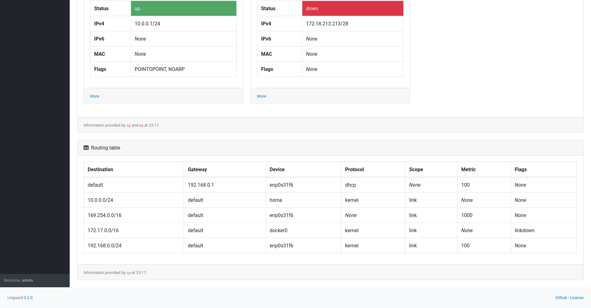

    Routing information

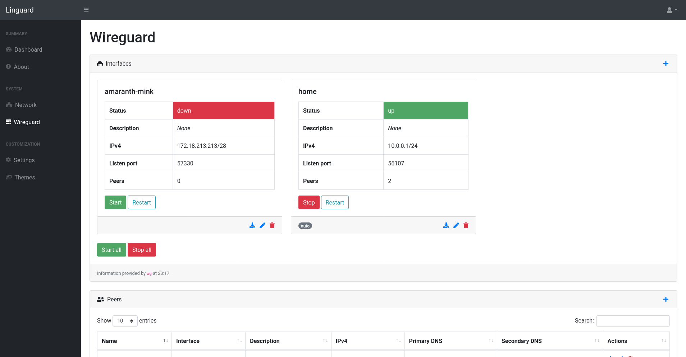

    Wireguard interfaces

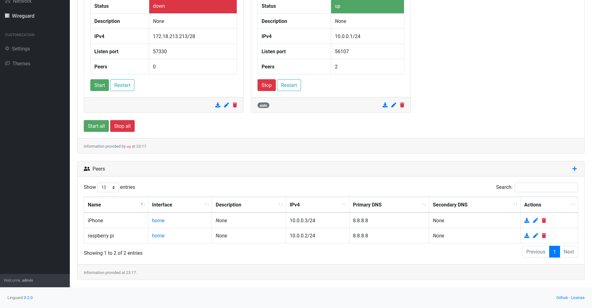

    Wireguard peers

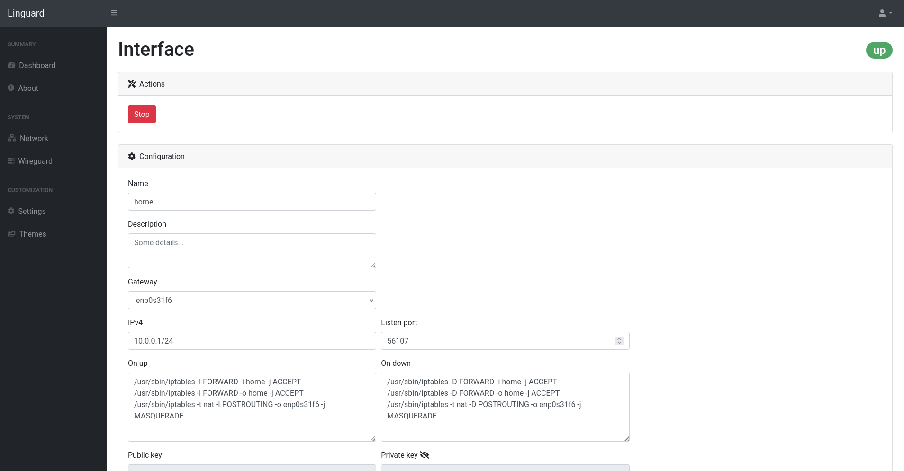

    Interface's actions and configuration

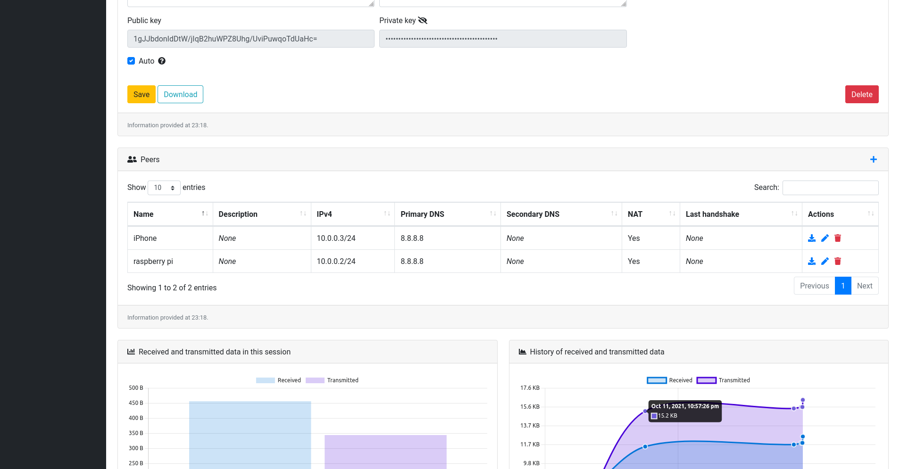

    Interface's peers and traffic data (1)

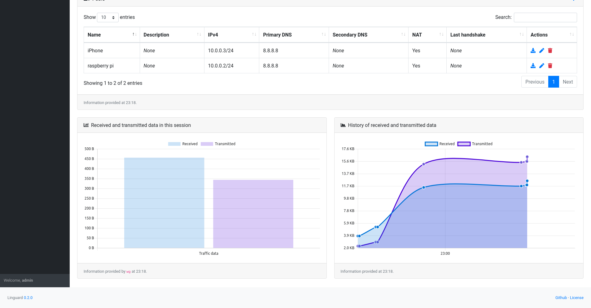

    Interface's peers and traffic data (2)

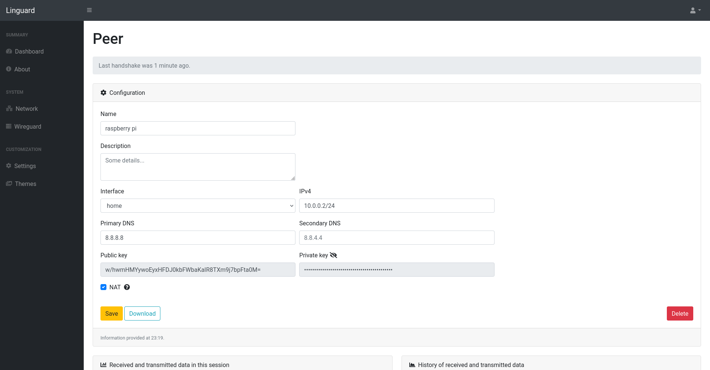

    Peer's configuration

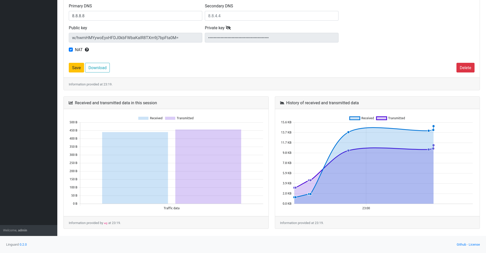

    Peer's traffic data

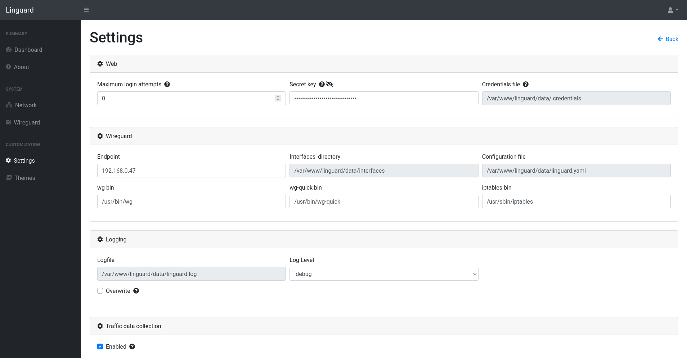

    Settings (1)

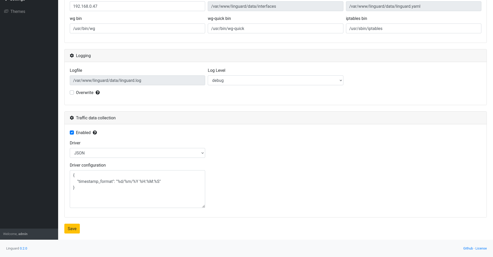

    Settings (2)